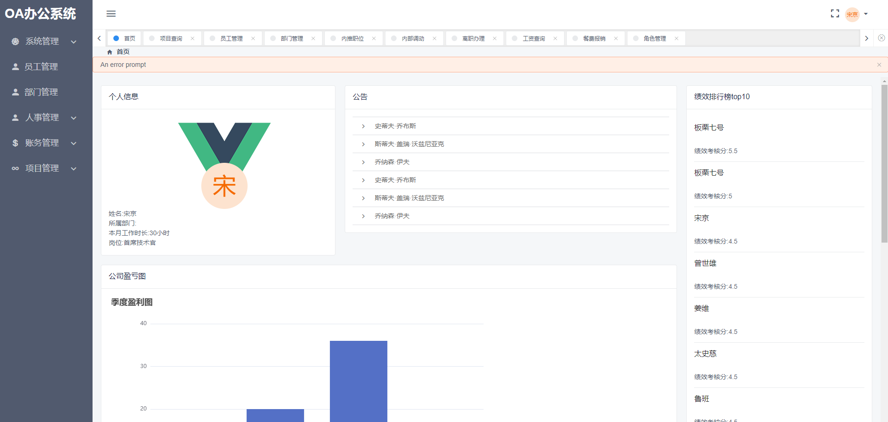
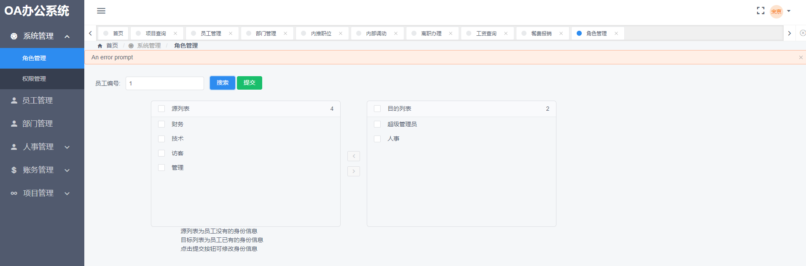
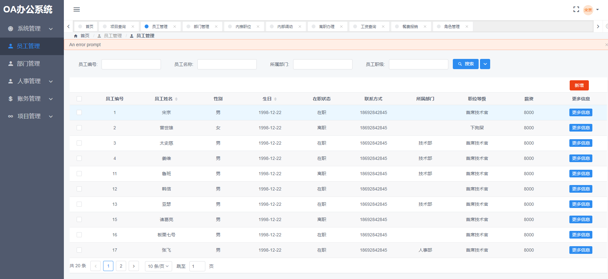

# oavue

> A Vue.js project OA系统 毕业设计 参考iview-admin模板
>vue2全家桶 +view design UI库

## 首页


## 权限管理
根据登录员工的角色获取动态路由数据
### 修改角色


## 员工管理

``` bash
# install dependencies
npm install

# serve with hot reload at localhost:8080
npm run dev

# build for production with minification
npm run build

# build for production and view the bundle analyzer report
npm run build --report
```

For a detailed explanation on how things work, check out the [guide](http://vuejs-templates.github.io/webpack/) and [docs for vue-loader](http://vuejs.github.io/vue-loader).
